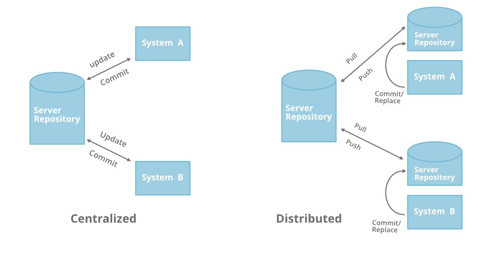

# Intro to version control and git

- Version control system:
record changes to file
- When to use one: changing over a period of time
  - Benefits: revert changes for files
  - compare changes over time
  - see who did what, when
  - when things go wrong, can rollback to previous version

## Types of version control
- manual version control: manually backing up files and a remaining system
- How did early control systems work: 
  - some were more labour intensive 
  - Tracked individual files and not a collective
  - base file, delta = difference, build up of deltas
- centralised VCS vs distributed VCS (git)
  
  - Centralised: 
    - locks file when downloaded so onl yone person can use it
    - update file and unlock then close file and send back to reposiotory
  - Distributed:
    - clone the files and work locally 
    - if user makes changes to og repository, your file will need to be in sync (need latest changes) work on a differnet branch
    - No need connection to server repository
    - 

