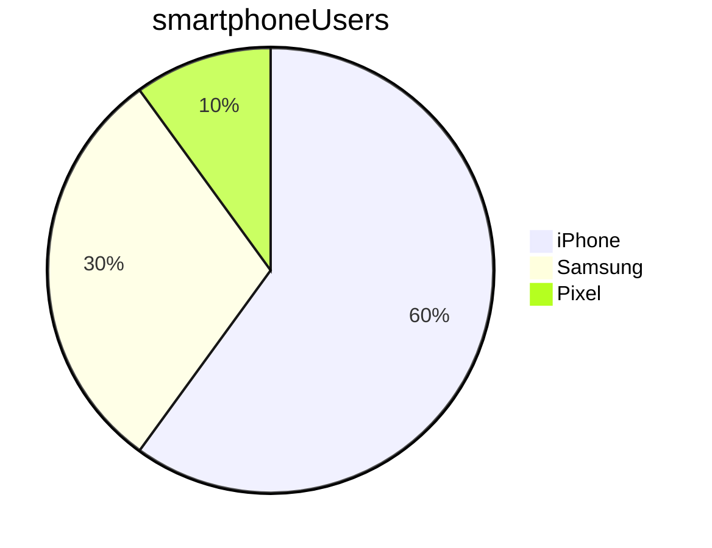

# Markdown learning

## Headings

### markdown is converting into html

<br>
- line break

* use * to make a bullet point

## Lists

### Bulleted lists (unordered)

* list item 1
* list item 2
- List item 3

### Numbered list

1. first step
2. second step
3. done

### Mixed lists:

* list item 1
  1. do this
     * yo
     * dbeiwifwe
  2. and that 
* list item 2

## bold and italics

I want to blod the word **cat** in this sentence
I want to italicised the word _cat_ in this sentence

## Quotes

> When shall we three meet again
>> shakespeare
> 
> # In thunder?
> # Lightning?
> * 0r rain?
> 

## Images and links:

Here is an embedded image:


Here is a link to the same image
[strange_man.jpg](../images/strange_man.jpg)

## Formatting code and commands

```python
# This is same python code: 
print('hello')
```

This is some Python code: `print('hello')`

- [ ] done
- [x] done

Name    |   Street   |  Town
--------|------------|----------
Cathy   | Main St    | Birmingham
John    | Maple Drive  | Stafford

## Mermaid

Example of visualisation


